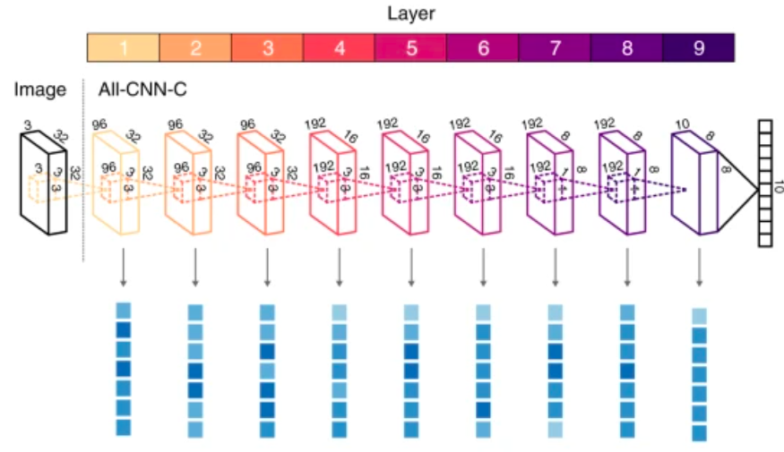

# Usability of CNNs and Attention Mechanisms for The Diagnosis of Melanoma

악성 흑색종 (이하 Melanoma)는 서구 국가, 특히 미국에서 전체 악성 종양의 약 2%를 차지하며 매년 9,000명 이상이 사망하는 질병입니다. 일반적으로 피부 병변은 육안으로 정확하게 진단하기 어렵지만 초기 단계에서 정확하게 탐지해낼 수 있다면 추가 진단을 위한 불필요한 시간과 비용을 줄이는 데 큰 도움이 됩니다. 본 연구에서는 주어진 피부 병변 이미지 데이터에 대해 피부암 분류 문제 해결을 위한 딥러닝 기반 CNN을 활용한 솔루션을 제안합니다. <br/>

전처리를 통해 주어진 데이터 셋이 가진 클래스 불균형 문제를 해결하고, 백본 아키텍처 모델을 선택하여 해당 모델의 진단 작업에서의 성능을 알아봅니다. 이후 더 나아가서 기존 모델에 새로운 딥러닝 기법인 'Attention mechanisms'을 적용하여, 대체된 레이어를 갖는 모델 아키텍처가 더 나은 성능을 갖는지 확인합니다.<br/>

 <br/><br/>

이 프로젝트는 Google Colab 환경에서 Python을 사용하여 진행되었으며, Pytorch 프레임워크의 라이브러리 활용을 위해 GPU or TPU 환경에서의 CUDA 사용이 필수적입니다. 더 자세한 분석 방법 및 결과는 다음과 같은 추가 코드 파일 및 리포트에서 확인하실 수 있습니다.<br/> 
- [(해당 연구에 대한 code 보러가기)](project.ipynb) (현재 개인적인 이유로 비공개 상태이며, 원하는 경우 이메일로 요청 바랍니다)<br/>
- [(해당 연구에 대한 full report 보러가기)](report.pdf) <br/> 


## Database

본 연구에서는 ISIC에서 제공하는 2020 공개 피부 병변 이미지 데이터를 사용하였습니다. 해당 데이터를 병변 부위를 기준으로 정사각형으로 자른 뒤 128x128 크기로 조정된 이미지 셋을 활용하였습니다. 데이터에는 환자의 피부 병변 이미지뿐만 아니라 점의 위치, 환자의 나이 및 성별 등의 메타데이터도 포함되어 있습니다. 그 중 이 프로젝트에서 가장 초점을 맞춘 부분은 malignant/benign 의 이진 분류 형식으로 나타나는 실제 melanoma 여부 입니다.<br/> 

- Metadata: <br/>
 <br/><br/>

- Benign vs. Malignant samples in image data: <br/>
      <br/>

## Pre-Processing

### 1. Imbalanced Class Problem

주어진 트레이닝 세트에 있는 두 클래스간의 큰 샘플 수 차이는 과적합을 유발합니다. 이는 훈련 시 모든 데이터를 양성으로만 분류하는 문제를 발생시키므로, re-sampling을 통해 소수 클래스의 샘플을 복사하여 표본의 수를 직접 조정하는 오버 샘플링 방식을 사용하였습니다. 샘플의 무작위 복제를 위해 Python Scikit-Learn 라이브러리에서 제공하는 resampling module이 사용되었습니다.<br/>

- Changes  in  sample  distribution  between  classes  depending  onoversampling: <br/>
  | original data distribution | oversampled data distribution |
  |:--:|:--:|
  |  |  |
  

### 2. Data Augmentation

중소 규모 데이터 세트에서 과적합을 방지하는 또 다른 방법으로 Data Augmentation 기술을 사용하였습니다. 이 연구에서는 가장 인기있는 augmentation 라이브러리 중 하나인 Almentations을 사용하여 다음과 같은 함수를 적용하였습니다: Transpose, Flip, Rotate, RandomBrightness, GaussNoise, OpticalDistortion, RandomContrast, MotionBlur, CLAHE, HueSaturationValue, MedianBlur, Gaus- sianBlur, GridDistortion, ShiftScaleRotate, ElasticTransform, Cutout <br/>

 <br/>

이 augmentation 기법은 2020 Melanoma detection by Kaggle 의 winning strategy 를 참고하였습니다.  <br/>

## Model

### 1. AlexNet

 <br/>

### 2. AllConvNet

 <br/>

## Attention Mechanisms on AllConvNet

Attention mechanisms은 현재 자연어처리(NLP)에서 주목받고 있는 인기있는 메커니즘 중 하나입니다. 이 프로젝트에서는 자연어 처리가 아닌 컴퓨터 비전을 위한 새로운 attention layer를 구성합니다. 이후, 백본 모델(AllConvNet)의 첫번째 컨볼루션 레이어를 새롭게 구성한 attention convolution layer로 대체시킵니다. 즉, 새로 구성된 모델의 구조는 첫번째 레이어만 Attention layer로 대체되었다는 점을 제외하고 나머지 구조나 입출력 채널의 수, 커널 크기 등 모두 백본 모델과 완전히 동일합니다.

#### >> Attention convolution layer

```python
class AttConv(nn.Module):
    def __init__(self, num_in_chan=1, num_out_chan=6, kernel_size=5, stride=1):
        super(AttConv, self).__init__()
        self.kernel_size=kernel_size
        self.num_in_chan=num_in_chan
        self.num_out_chan=num_out_chan
        self.stride=stride
        self.BU_weights = nn.Parameter(torch.HalfTensor(1,num_in_chan*kernel_size**2, 1, num_out_chan))
        init.kaiming_uniform_(self.BU_weights, a=np.sqrt(5))
        self.TD_weights = nn.Parameter(self.BU_weights.data.detach().clone())
        
        self.BU_bias = nn.Parameter(torch.randn(1,1,1,num_out_chan)*0.1)
        self.TD_bias = nn.Parameter(torch.randn(1,num_in_chan,1,1)*0.1)
        
    def normalize_att_weights(self, in_spat_dim):
        batch_size = self.att_weights.shape[0]        
        num_wins = self.att_weights.shape[-1]
        aw_sum = F.unfold(F.fold(self.att_weights, in_spat_dim, self.kernel_size,stride=self.stride), self.kernel_size, stride=self.stride) #Fold into image domain (which automatically computes the sum per pixel), and then unfold again into conv windows    
        self.att_weights = self.att_weights/aw_sum #Normalize weights by their sum over possible parents
        self.att_weights = self.att_weights.view(batch_size, 1, self.kernel_size**2, num_wins).expand(batch_size, self.num_in_chan, self.kernel_size**2, num_wins).reshape(batch_size, self.num_in_chan*self.kernel_size**2, num_wins)
        
        
    def forward(self, x, num_iter=4):
        batch_size = x.shape[0]
        device = x.device
        in_spat_dim = list(x.shape[-2:])                
        assert in_spat_dim[0]==in_spat_dim[1], 'Only square images are supported'
        x_wins = F.unfold(x.view(batch_size,self.num_in_chan,*in_spat_dim), self.kernel_size, stride=self.stride)
        x_wins = x_wins.type(torch.half)
        out_spat_dim = np.int(np.sqrt(x_wins.shape[-1]))
        self.att_weights = torch.ones([batch_size, self.kernel_size**2, x_wins.shape[-1]], device=device, dtype=torch.half)        
        self.normalize_att_weights(in_spat_dim)
        
        
        for i in range(num_iter):
            y = F.relu((x_wins.unsqueeze(-1)*self.att_weights.unsqueeze(-1)*self.BU_weights).sum(1,True) + self.BU_bias)
            pred = (y*self.TD_weights).sum(-1).view(batch_size,self.num_in_chan,self.kernel_size**2, -1) + self.TD_bias            
            self.att_weights = ((pred*x_wins.view(batch_size,self.num_in_chan,self.kernel_size**2, -1)).sum(1) / np.sqrt(self.num_in_chan)).exp()
            self.normalize_att_weights(in_spat_dim)   

        y = y.view(batch_size, out_spat_dim, out_spat_dim, self.num_out_chan).permute(0,3,1,2)
        
        return y
```


## Evaluation

이전의 예상과 달리, 주의 매커니즘을 적용할 때 더 진단에 용이하다는 눈에 띄는 유효한 결과를 얻지 못했으므로, 실제로 모델간의 명확한 성능 차이를 알아볼 필요가 있습니다. 따라서 Mcnemar's test를 이용하여 백본 모델과 주의 매커니즘이 적용된 모델 간의 성능차이를 살펴보았습니다.<br/>

 <br/>

위 그림은 original AllConvNet 과 Attentional AllConvNet을 비교한 contingency를 나타냅니다. Mcnemar's test를 수행한 결과 statistic=24.733, p-value=0.0000 이므로 null hypothesis(H0)를 기각합니다. 즉, 두 예측 모델 간 차이가 없다고 가정하지 않습니다.<br/>


## Result

더 자세한 결과 및 고찰은 [full report](report.pdf)를 참조하시기 바랍니다.


